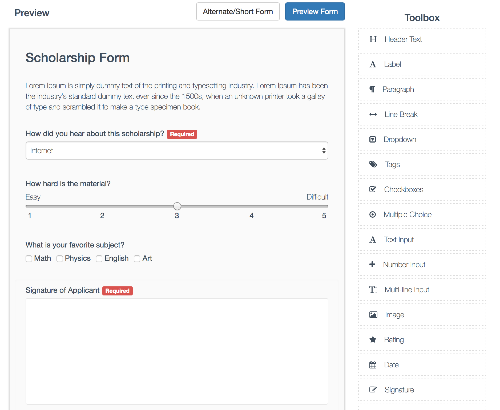

[](//npmjs.com/package/ecsite-form-builder)
[](https://img.shields.io/npm/dm/ecsite-form-builder.svg)
# V5GL Form Builder
A complete react form builder that interfaces with a json endpoint to load and save generated forms.
- Upgraded to React 16.8.6
- Bootstrap 4.x, Font-Awesome 5.x
- Use react-dnd for Drag & Drop
- Save form data with dummy api server
- Show posted data on readonly form
- Multi column row

<!-- [DEMO](https://kiho.github.io/react-form-builder/) Slow Loading.... back-end is running at FREE Heroku. -->



### Editing Items


# Basic Usage
## index.html
```html
<!DOCTYPE html>
<html lang="en">

<head>
  <meta charset="utf-8" />
  <link rel="icon" href="%PUBLIC_URL%/favicon.ico" />
  <meta name="viewport" content="width=device-width, initial-scale=1" />
  <meta name="theme-color" content="#000000" />
  <meta name="description" content="Web site created using create-react-app" />
  <link rel="apple-touch-icon" href="%PUBLIC_URL%/logo192.png" />
  <!--
      manifest.json provides metadata used when your web app is installed on a
      user's mobile device or desktop. See https://developers.google.com/web/fundamentals/web-app-manifest/
    -->
  <link rel="manifest" href="%PUBLIC_URL%/manifest.json" />
  <!--
      Notice the use of %PUBLIC_URL% in the tags above.
      It will be replaced with the URL of the `public` folder during the build.
      Only files inside the `public` folder can be referenced from the HTML.

      Unlike "/favicon.ico" or "favicon.ico", "%PUBLIC_URL%/favicon.ico" will
      work correctly both with client-side routing and a non-root public URL.
      Learn how to configure a non-root public URL by running `npm run build`.
    -->
    <link rel="stylesheet" href="https://use.fontawesome.com/releases/v5.13.0/css/all.css">
  <link rel="stylesheet" href="https://stackpath.bootstrapcdn.com/bootstrap/4.4.1/css/bootstrap.min.css"
    integrity="sha384-Vkoo8x4CGsO3+Hhxv8T/Q5PaXtkKtu6ug5TOeNV6gBiFeWPGFN9MuhOf23Q9Ifjh" crossorigin="anonymous">
  <link rel="stylesheet" type="text/css" href="dist/app.css">

  <link rel="stylesheet" href="https://fonts.googleapis.com/css?family=Roboto:300,400,500,700&display=swap" />
  <link rel="stylesheet" href="https://fonts.googleapis.com/icon?family=Material+Icons" />
  <style>
    body {
      font-size: 14px;
      font-weight: 300;
      color: #404d5b;
      width: 1200px;
      margin: 0 auto;
    }

    .modal {
      background: rgba(0, 0, 0, 0.3);
    }

    .modal-content {
      padding: 30px;
      max-height: 570px;
      overflow-y: auto
    }
  </style>
  <title>React App</title>
</head>

<body>
  <noscript>You need to enable JavaScript to run this app.</noscript>
  <div id="root"></div>
  <div id="demo-bar"></div>
  <div id="form-builder"></div>
  <!--
      This HTML file is a template.
      If you open it directly in the browser, you will see an empty page.

      You can add webfonts, meta tags, or analytics to this file.
      The build step will place the bundled scripts into the <body> tag.

      To begin the development, run `npm start` or `yarn start`.
      To create a production bundle, use `npm run build` or `yarn build`.
    -->
</body>

</html>
```
## index.js
```javascript
import React from 'react';
import ReactDOM from 'react-dom';
import { V5FormBuilder, V5FormBuilderDemoBar } from 'v5gl-form-builder';
import 'v5gl-form-builder/dist/app.css';

ReactDOM.render(
  <React.StrictMode>
    <V5FormBuilder />
  </React.StrictMode>,
  document.getElementById('form-builder')
);

ReactDOM.render(
  <React.StrictMode>
    <V5FormBuilderDemoBar />
  </React.StrictMode>,
  document.getElementById('demo-bar')
);
```

# Props

```javascript
var items = [{
  key: 'Header',
  name: 'Header Text',
  icon: 'fa fa-header',
  static: true,
  content: 'Placeholder Text...'
},
{
  key: 'Paragraph',
  name: 'Paragraph',
  static: true,
  icon: 'fa fa-paragraph',
  content: 'Placeholder Text...'
}];

<ReactFormBuilder
  url='path/to/GET/initial.json'
  toolbarItems={items}
  saveUrl='path/to/POST/built/form.json' />
```

# React Form Generator
Now that a form is built and saved, let's generate it from the saved json.

```javascript
import React from 'react';
import ReactDOM from 'react-dom';
import { ReactFormGenerator } from 'ecsite-form-builder';
import 'ecsite-form-builder/dist/app.css';

ReactDOM.render(
  <ReactFormGenerator
    form_action="/path/to/form/submit"
    form_method="POST"
    task_id={12} // Used to submit a hidden variable with the id to the form from the database.
    answer_data={JSON_ANSWERS} // Answer data, only used if loading a pre-existing form with values.
    authenticity_token={AUTH_TOKEN} // If using Rails and need an auth token to submit form.
    data={JSON_QUESTION_DATA} // Question data
  />,
  document.body
)
```

### Form Params

Name | Type | Required? | Description
--- | --- | --- | ---
form_action | string | Required | URL path to submit the form
form_method | string | Required | Verb used in the form submission.
action_name | string | Optional | Defines form submit button text.  Defaults to "Submit"
onSubmit | function | optional | Invoke when submit data, if exists will override form post.
data | array | Required | Question data retrieved from the database
back_action | string | Optional | URL path to go back if needed.
back_name | string | Optional | Button text for back action.  Defaults to "Cancel".
task_id | integer | Optional | User to submit a hidden variable with id to the form on the backend database.
answer_data | array | Optional | Answer data, only used if loading a pre-existing form with values.
authenticity_token | string | Optional | If using Rails and need an auth token to submit form.
hide_actions | boolean | Optional | If you would like to hide the submit / cancel buttons set to true.
skip_validations | boolean | Optional | Suppress form validations on submit, if set to true.
display_short | boolean | Optional | Display an optional "shorter page/form" which is common for legal documents or situations where the user will just have to sign or fill out a shorter form with only the critical elements.
read_only | boolean | Optional | Shows a read only version which has fields disabled and removes "required" labels.
variables | object | Optional | Key/value object that can be used for Signature variable replacement.

### Read only Signatures

Read only signatures allow you to use a saved/canned signature to be placed into the form. The signature will be passed in through the `variables` property to `ReactFormGenerator` and `ReactFormBuilder`.

To use a read only signature, choose the "Read only" option and enter the key value of the variable that will be used to pass in the signature.


The signature data should be in base 64 format.

There is a `variables.js` file that contains a sample base 64 signature. This variable is passed into the demo builder and generator for testing. Use the variable key "JOHN" to test the variable replacement.

# Vendor Dependencies
In order to make the form builder look pretty, there are a few dependencies other than React. Style sheets from `Bootstrap` and `FontAwesome` must be added to index.html. See the example code in [index.html](https://github.com/Kiho/react-form-builder/blob/master/public/index.html#L5) for more details.

- Bootstrap
- FontAwesome

# SASS
All relevant styles are located in css/application.css.scss.

# Develop
```bash
$ npm install
$ npm run build:dist
$ npm run serve:api
$ npm start
```
Then navigate to http://localhost:8080/ in your browser and you should be able to see the form builder in action.

# Examples
- [Basic](https://github.com/Kiho/react-form-builder/tree/master/examples/demo)
- [JSON Post](https://github.com/Kiho/react-form-builder/tree/master/examples/custom)
- [UMD](https://github.com/Kiho/react-form-builder/tree/master/examples/umd)
- [NEXT](https://github.com/Kiho/react-form-builder/tree/master/examples/next)
- [NEXT-Mongo](https://github.com/Kiho/react-form-builder/tree/master/examples/mongo)
- [create-react-app](https://github.com/Kiho/react-form-builder/tree/master/examples/cra)

# Tests
```bash
$ npm test
```
Test is not working at this moment.
